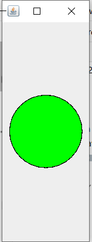
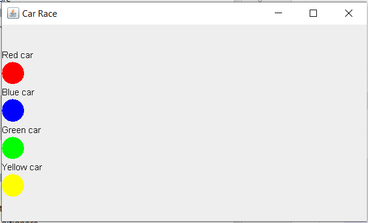

# Aplicație Car Race

Aplicație Car Race

Această aplicație folosește conceptele OOP prin intermediul limbajului Java și utilizează fire de execuție pentru a simula o cursă între 4 mașini. Acestea porneste în urma culorii verzi a semaforului, iar la final se afișează un leaderboard cu locul obținut de fiecare mașină și timpul în care au terminat cursa.

